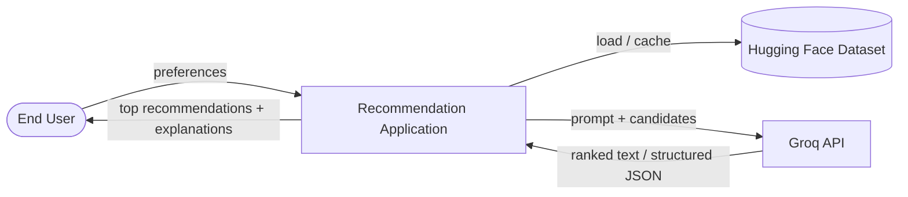
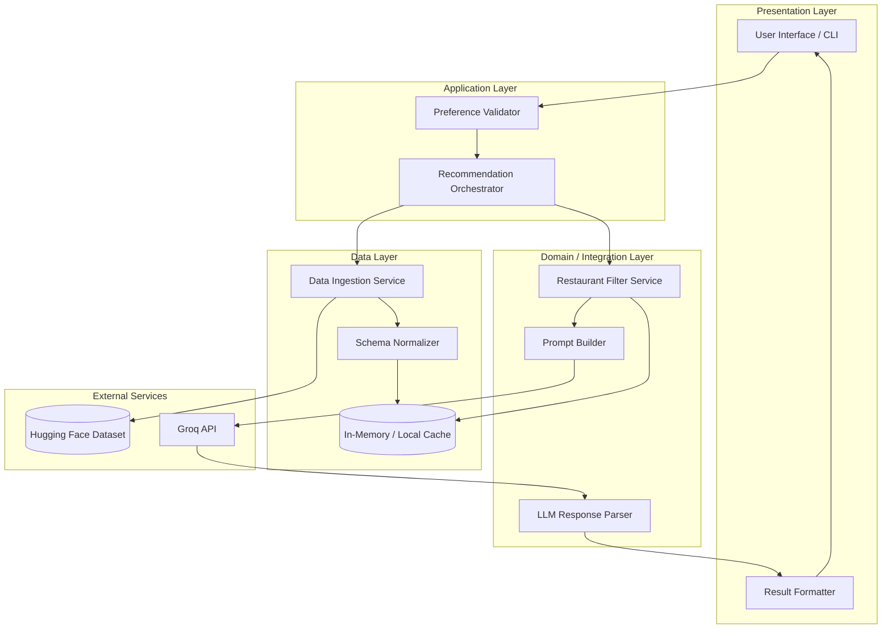
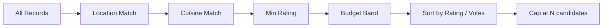
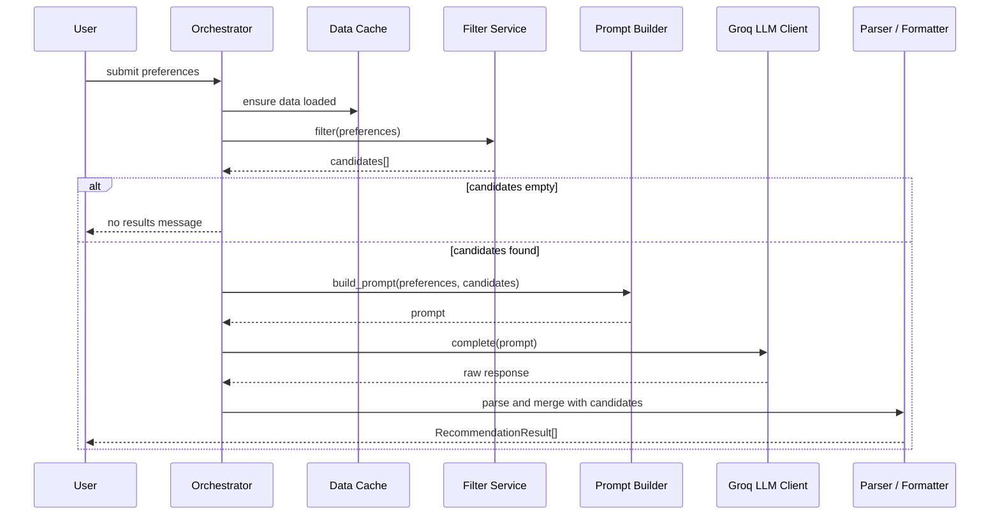
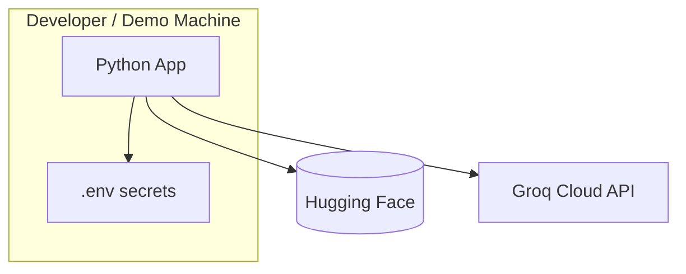

# System Architecture: AI-Powered Restaurant Recommendation System

This document defines the technical architecture for the Zomato-inspired restaurant recommendation service described in [`context.md`](context.md). It translates product requirements into components, data flows, interfaces, and design decisions suitable for implementation.

---

## 1. Architecture Goals

| Goal | Description |
|------|-------------|
| **Accuracy of facts** | Restaurant name, location, cuisine, cost, and rating come from the dataset—not from LLM hallucination. |
| **Personalization** | LLM ranks and explains choices using user preferences and filtered candidates. |
| **Separation of concerns** | Data loading, filtering, prompting, inference, and presentation are distinct modules. |
| **Testability** | Filtering and prompt construction can be unit-tested without calling the LLM. |
| **Milestone scope** | Single application, dataset-backed, no production auth or live Zomato API. |

---

## 2. System Context

External actors and systems interact with the recommendation application as follows.



| Actor / System | Role |
|----------------|------|
| **End User** | Supplies location, budget, cuisine, minimum rating, optional free-text preferences. |
| **Hugging Face Dataset** | Source of truth for restaurant records (`ManikaSaini/zomato-restaurant-recommendation`). |
| **Groq** | Hosted LLM inference—ranks candidates, writes explanations, optional summary. |
| **Application** | Orchestrates ingestion, filtering, prompting, and display. |

---

## 3. High-Level Architecture

The system follows a **layered pipeline architecture**: each stage consumes structured output from the previous stage and passes a smaller, richer payload forward.



### Layer Summary

| Layer | Responsibility | Key modules |
|-------|----------------|-------------|
| **Presentation** | Collect preferences; render ranked results | UI, Result Formatter |
| **Application** | Request lifecycle, validation, orchestration | Orchestrator, Validator |
| **Domain / Integration** | Business rules: filter, prompt, parse LLM | Filter, Prompt Builder, Parser |
| **Data** | Load, normalize, cache restaurant records | Ingestion, Normalizer, Cache |
| **External** | Dataset and model inference | Hugging Face, Groq API |

---

## 4. Component Design

### 4.1 Data Ingestion Service

**Purpose:** Load the Zomato dataset from Hugging Face once (or on schedule) and expose normalized records to the rest of the app.

| Concern | Design decision |
|---------|-----------------|
| **Load trigger** | On application startup or explicit refresh command. |
| **Library** | `datasets` (Hugging Face) or equivalent loader. |
| **Output** | List or DataFrame of `RestaurantRecord` objects (see §6). |
| **Caching** | Keep normalized data in memory for fast filtering; optional pickle/Parquet for offline dev. |
| **Failure handling** | Retry with backoff on network errors; fail fast with clear message if schema mismatch. |

**Processing steps:**

1. Download / stream dataset from configured URL.
2. Map raw columns to canonical field names.
3. Clean nulls, trim strings, parse numeric ratings and cost.
4. Normalize location and cuisine strings (case, aliases).
5. Register records in the in-app cache.

---

### 4.2 Schema Normalizer

**Purpose:** Ensure every record conforms to a single internal schema regardless of raw column naming in the dataset.

| Raw concept (expected) | Canonical field |
|------------------------|-----------------|
| Restaurant identifier / name | `id`, `name` |
| City / area | `location` |
| Cuisine type(s) | `cuisines` (list or delimited string) |
| Price / cost for two | `estimated_cost` |
| Aggregate rating | `rating` |
| Optional: votes, address, rest type | `metadata` (extensible) |

---

### 4.3 Preference Validator

**Purpose:** Validate and normalize user input before filtering or LLM calls.

| Field | Validation rules |
|-------|------------------|
| `location` | Required; non-empty string; optional fuzzy match against known cities. |
| `budget` | Enum: `low` \| `medium` \| `high`; map to cost bands using dataset statistics. |
| `cuisine` | Optional; string or list; case-insensitive match. |
| `min_rating` | Optional; float in [0, 5] (or dataset max). |
| `additional_preferences` | Optional free text; passed to LLM only (not hard-filter unless keywords mapped). |

**Output:** `UserPreferences` DTO consumed by the filter and prompt builder.

---

### 4.4 Restaurant Filter Service

**Purpose:** Reduce the full dataset to a **candidate set** (e.g., top 20–50 by rating) that fits hard constraints. This keeps LLM context small and costs low.

**Filter pipeline (sequential):**



| Filter | Logic |
|--------|--------|
| **Location** | Substring or normalized equality on `location` field. |
| **Cuisine** | Record cuisines contain requested type (split multi-cuisine strings). |
| **Min rating** | `rating >= min_rating`. |
| **Budget** | Map `low` / `medium` / `high` to percentile or fixed cost ranges derived from dataset. |
| **Cap** | Return at most `MAX_CANDIDATES` (recommended: 15–30) for LLM context. |

**Empty result policy:** If zero matches, relax least critical constraint (e.g., cuisine) or return a user-facing message—do not call the LLM with an empty list.

---

### 4.5 Prompt Builder

**Purpose:** Construct a deterministic, versioned prompt that includes user preferences and structured candidate data.

**Prompt structure:**

1. **System role** — You are a restaurant recommendation assistant. Use only the provided restaurant data. Do not invent restaurants or change ratings/costs.
2. **User preferences** — Serialized `UserPreferences` (including `additional_preferences`).
3. **Candidate table** — JSON or markdown table: `name`, `location`, `cuisines`, `rating`, `estimated_cost`.
4. **Tasks** — Rank top K (e.g., 5); for each, explain fit; optional one-paragraph summary.
5. **Output format** — Request JSON schema for reliable parsing (see §7.3).

**Design principles:**

- Include only filtered candidates, not the full dataset.
- Repeat constraint: facts must match input rows.
- Keep token count bounded via candidate cap.

---

### 4.6 Recommendation Engine (LLM Client)

**Purpose:** Send the prompt to the LLM and receive ranked recommendations with explanations.

| Concern | Design decision |
|---------|-----------------|
| **Provider (milestone)** | **[Groq](https://console.groq.com/)** — fast hosted inference; not OpenAI for this project. |
| **Role** | Rank, explain, summarize—not invent factual fields. |
| **Interface** | Abstract `LLMClient` with `complete(system, user) -> str`; default impl `GroqLLMClient`. |
| **SDK** | Official `groq` Python package (`Groq` client, chat completions). |
| **Parameters** | Low temperature (0.2–0.5); sufficient `max_tokens` for K explanations. |
| **JSON output** | Request JSON in the prompt; use Groq `response_format` where the model supports it. |
| **Timeout** | Configurable; surface timeout errors in UI. |
| **Retries** | Limited retries on transient API errors (429, 5xx) only. |

**Default model (example):** `llama-3.3-70b-versatile` (override via `LLM_MODEL` in `.env`).

**Optional enhancement:** Two-step flow—(1) LLM returns ranked IDs/names only; (2) merge explanations with dataset rows in code to guarantee fact alignment.

**Note:** `LLMClient` remains abstract so tests use `MockLLMClient`; production and Phase 4 orchestration use **Groq only**.

---

### 4.7 LLM Response Parser

**Purpose:** Convert model output into typed `Recommendation` objects for the UI.

- Prefer **structured output** (JSON mode / schema instruction).
- Validate each recommended name exists in the candidate set.
- On parse failure: retry once with stricter format instruction or fall back to rule-based top-N by rating with generic explanation.

---

### 4.8 Result Formatter & Presentation Layer

**Purpose:** Present human-readable, consistent output.

**Per recommendation card / row:**

| Display field | Source |
|---------------|--------|
| Restaurant Name | Dataset (verified) |
| Cuisine | Dataset |
| Rating | Dataset |
| Estimated Cost | Dataset |
| Explanation | LLM |
| Rank | LLM or parser |

**UI options (milestone):**

- **Web:** Streamlit, Gradio, or simple React/Vite form + results list.
- **CLI:** argparse / Typer for demos and scripts.

**Location input — dropdown from dataset (not free text):**

The location field in the UI **must** be populated dynamically from the loaded dataset, not a blank text input. After the dataset is loaded into the cache, extract the union of:
- All unique values of `RestaurantRecord.location` (area/neighbourhood level, e.g. *Indiranagar*, *Belandur*, *Koramangala*)
- All unique values of `metadata["listed_in(city)"]` (city level, e.g. *Bangalore*, *Delhi*)

Sort the combined set alphabetically and render as a searchable `selectbox` (Streamlit) or `<select>` / autocomplete (web). This prevents users from entering locations with no data and makes the UI self-documenting.

> **Implementation note:** Use `@st.cache_data` (keyed on the orchestrator object) so the location list is computed once after dataset load rather than on every Streamlit rerun.

---

### 4.9 Recommendation Orchestrator

**Purpose:** Single entry point coordinating the end-to-end flow.



---

## 5. Data Flow (End-to-End)

```
[Hugging Face] 
    → load → normalize → [RestaurantRecord[]] 
    → cache

[User] 
    → preferences → validate → [UserPreferences]

[UserPreferences] + [RestaurantRecord[]] 
    → filter → [Candidate[]] (≤ N)

[UserPreferences] + [Candidate[]] 
    → prompt → [LLM] 
    → parse → [Recommendation[]]

[Recommendation[]] 
    → format → [UI]
```

---

## 6. Domain Model

### 6.1 RestaurantRecord

```text
RestaurantRecord
├── id: string              # stable id or hash of name+location
├── name: string
├── location: string
├── cuisines: list[string]
├── rating: float
├── estimated_cost: float | string   # normalized numeric if possible
└── metadata: dict          # optional raw fields
```

### 6.2 UserPreferences

```text
UserPreferences
├── location: string
├── budget: "low" | "medium" | "high"
├── cuisine: string | null
├── min_rating: float | null
└── additional_preferences: string | null
```

### 6.3 Recommendation

```text
Recommendation
├── rank: int
├── restaurant: RestaurantRecord   # always from dataset
├── explanation: string            # from LLM
└── summary: string | null         # optional batch summary
```

---

## 7. Interfaces & Contracts

### 7.1 Internal Service Interfaces (conceptual)

| Service | Method | Input | Output |
|---------|--------|-------|--------|
| `DataIngestionService` | `load()` | — | `list[RestaurantRecord]` |
| `RestaurantFilterService` | `filter(prefs, records)` | `UserPreferences`, records | `list[RestaurantRecord]` |
| `PromptBuilder` | `build(prefs, candidates)` | prefs, candidates | `str` |
| `LLMClient` | `complete(prompt)` | `str` | `str` |
| `RecommendationService` | `recommend(prefs)` | `UserPreferences` | `list[Recommendation]` |

### 7.2 Budget Band Configuration

Define bands from dataset percentiles at load time:

| Budget | Typical mapping (example) |
|--------|---------------------------|
| `low` | cost ≤ 33rd percentile |
| `medium` | 33rd < cost ≤ 66th |
| `high` | cost > 66th |

Exact thresholds should be computed from `estimated_cost` after normalization.

### 7.3 LLM Output Schema (recommended)

```json
{
  "summary": "Optional overall summary for the user.",
  "recommendations": [
    {
      "rank": 1,
      "restaurant_name": "Exact name from candidate list",
      "explanation": "Why this fits the user's preferences."
    }
  ]
}
```

Post-processing merges `restaurant_name` with `RestaurantRecord` by exact or fuzzy match; mismatches are dropped or flagged.

---

## 8. Suggested Project Structure

```text
zomato-milestone/
├── context.md
├── architecture.md
├── problemstatement.txt
├── src/
│   ├── main.py                 # entry (CLI or app launcher)
│   ├── config.py               # env, API keys, dataset URL, MAX_CANDIDATES
│   ├── models/
│   │   ├── restaurant.py
│   │   ├── preferences.py
│   │   └── recommendation.py
│   ├── data/
│   │   ├── ingestion.py
│   │   ├── normalizer.py
│   │   └── cache.py
│   ├── services/
│   │   ├── filter.py
│   │   ├── prompt_builder.py
│   │   ├── llm_client.py       # LLMClient + GroqLLMClient (default)
│   │   ├── parser.py
│   │   └── orchestrator.py
│   └── ui/
│       └── app.py              # Streamlit / Gradio / web
├── tests/
│   ├── test_filter.py
│   ├── test_normalizer.py
│   └── test_prompt_builder.py
├── requirements.txt
└── .env.example                # GROQ_API_KEY, LLM_MODEL, optional HF token
```

---

## 9. Technology Stack (Recommended)

| Concern | Suggested choice | Rationale |
|---------|------------------|-----------|
| Language | Python 3.10+ | Strong HF `datasets` and LLM SDK ecosystem |
| Dataset | `datasets`, `pandas` | Native Hugging Face loading |
| LLM | **Groq** (`groq` SDK) | Default provider; `LLMClient` abstraction for tests/mocks |
| UI (fast milestone) | Streamlit or Gradio | Minimal frontend code |
| Config | `python-dotenv` | Keep API keys out of source |
| Tests | `pytest` | Filter and prompt unit tests |

Stack is illustrative; any language that can load the dataset and call an LLM API is valid if modules preserve the boundaries above.

---

## 10. Cross-Cutting Concerns

### 10.1 Configuration

| Variable | Purpose |
|----------|---------|
| `DATASET_ID` | Hugging Face dataset path |
| `GROQ_API_KEY` | Groq API authentication (required for live recommendations) |
| `LLM_MODEL` | Groq model id (e.g. `llama-3.3-70b-versatile`, `llama-3.1-8b-instant`) |
| `LLM_TEMPERATURE` | Sampling temperature (default ~0.3) |
| `LLM_MAX_TOKENS` | Max completion tokens |
| `LLM_TIMEOUT_SECONDS` | Request timeout |
| `MAX_CANDIDATES` | Filter cap before LLM |
| `TOP_K` | Number of recommendations to show |

`LLM_API_KEY` may be supported as an alias for `GROQ_API_KEY` for backward compatibility; **Groq is the only production provider.**

### 10.2 Error Handling

| Scenario | Behavior |
|----------|----------|
| Dataset load failure | Block app start; show error with URL and retry hint |
| No filter matches | User message; suggest broader location or cuisine |
| LLM timeout / error | Retry once; fallback to rating-sorted top-K without AI explanations |
| Hallucinated restaurant name | Parser rejects; use next valid rank or dataset-only fallback |

### 10.3 Observability (milestone-appropriate)

- Log candidate count, prompt token estimate, and LLM latency.
- Do not log full API keys or raw PII.

### 10.4 Security

- Store secrets in environment variables, not in repo.
- Sanitize user free-text before logging.
- No auth required per [`context.md`](context.md) scope.

---

## 11. Non-Functional Requirements

| Attribute | Target (milestone) |
|-----------|---------------------|
| **Latency** | Dataset cached in memory; LLM call dominates (aim &lt; 15s P95) |
| **Scalability** | Single-user / demo; no horizontal scaling required |
| **Maintainability** | Clear module boundaries per §4 and §8 |
| **Reliability** | Graceful degradation when LLM unavailable |

---

## 12. Deployment View (Milestone)



- Run locally or on a single cloud VM / Streamlit Cloud.
- No Kubernetes, load balancers, or database required for v1.

---

## 13. Testing Strategy

| Layer | What to test |
|-------|----------------|
| **Normalizer** | Column mapping, null handling, type coercion |
| **Filter** | Location, cuisine, rating, budget bands; empty result |
| **Prompt builder** | Preferences and candidates appear; token size under limit |
| **Parser** | Valid JSON; rejects unknown restaurant names |
| **Integration** | Mock `LLMClient`; full orchestrator path |
| **E2E (optional)** | Manual or scripted run with real API key |

---

## 14. Mapping to Success Criteria

| [`context.md`](context.md) criterion | Architectural element |
|--------------------------------------|-------------------------|
| Dataset loads from Hugging Face | §4.1 Data Ingestion, §4.2 Normalizer |
| User specifies all preference types | §4.3 Validator, Presentation Layer |
| Filtering before LLM | §4.4 Filter Service |
| LLM rank + explain | §4.5 Prompt Builder, §4.6 Engine, §4.7 Parser |
| Friendly output fields | §4.8 Formatter, §6.3 Recommendation |

---

## 15. Future Extensions (Out of Current Scope)

Documented for clarity only—not required for the milestone:

- Vector search over reviews for semantic “family-friendly” filtering
- User accounts and saved preferences
- Real-time Zomato API instead of static dataset
- Caching LLM responses by preference hash
- A/B testing of prompt versions

---

## 16. References

- Project context: [`context.md`](context.md)
- Problem statement: [`problemstatement.txt`](problemstatement.txt)
- Dataset: [ManikaSaini/zomato-restaurant-recommendation](https://huggingface.co/datasets/ManikaSaini/zomato-restaurant-recommendation)

---

*Architecture derived from [`context.md`](context.md) — AI-Powered Restaurant Recommendation System (Zomato Use Case).*
