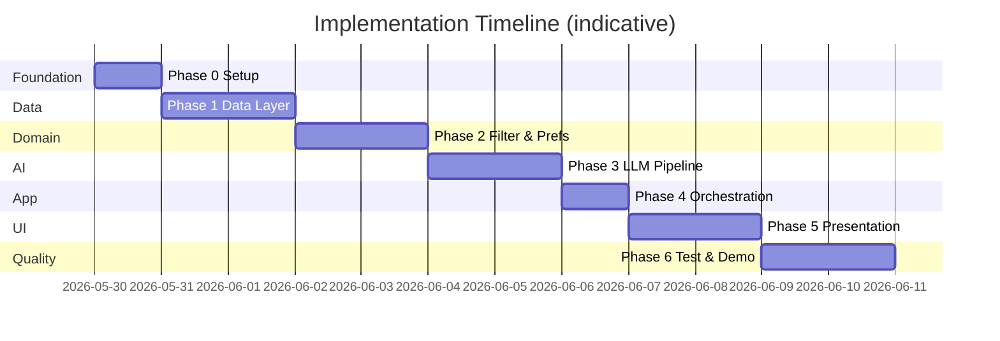
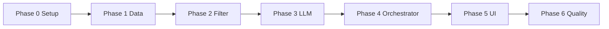

# Phase-Wise Implementation Plan

This plan breaks the AI-powered restaurant recommendation system into ordered phases. Each phase maps to [`context.md`](context.md) workflow stages and [`architecture.md`](architecture.md) components, with tasks, deliverables, dependencies, and acceptance criteria.

---

## Plan Overview



| Phase | Name | Primary workflow stage | Architecture focus |
|-------|------|------------------------|-------------------|
| **0** | Project setup | — | Repo structure, config, tooling |
| **1** | Data layer | Data ingestion | Ingestion, normalizer, cache, models |
| **2** | Filtering & preferences | User input + integration (filter) | Validator, filter, budget bands |
| **3** | LLM pipeline | Integration (prompt) + recommendation engine | Prompt builder, Groq LLM client, parser |
| **4** | Orchestration | End-to-end wiring | Orchestrator + **Groq** inference, error handling |
| **5** | Presentation | Output display | UI, result formatter |
| **6** | Quality & delivery | Full system | Tests, docs, demo |

**Estimated total duration:** 10–12 working days (solo developer, part-time adjust proportionally).

---

## Dependency Graph



Phases are **sequential**; do not start LLM integration until filtering returns sensible candidates from real data.

---

## Phase 0: Project Setup & Foundation

**Goal:** Runnable Python project with configuration, dependencies, and folder layout per architecture §8.

**Maps to:** Architecture §8 (project structure), §10.1 (configuration), §10.4 (security basics).

### Tasks

| # | Task | Details |
|---|------|---------|
| 0.1 | Initialize repository structure | Create `src/`, `tests/`, `models/`, `data/`, `services/`, `ui/` per architecture |
| 0.2 | Add `requirements.txt` | `datasets`, `pandas`, `python-dotenv`, **`groq`** (Groq SDK), UI lib (`streamlit` or `gradio`), `pytest` |
| 0.3 | Add `config.py` | Load `DATASET_ID`, `GROQ_API_KEY`, `LLM_MODEL`, `MAX_CANDIDATES`, `TOP_K` from env |
| 0.4 | Add `.env.example` | Document `GROQ_API_KEY`, Groq model id, dataset vars; add `.env` to `.gitignore` |
| 0.5 | Add `README.md` (minimal) | How to install, configure, and run (expand in Phase 6) |
| 0.6 | Verify Python environment | Python 3.10+; create venv; `pip install -r requirements.txt` |

### Deliverables

- [ ] Project skeleton committed (or ready to commit)
- [ ] `config.py` reads env without hardcoded secrets
- [ ] Empty `main.py` runs without import errors

### Acceptance criteria

- `python -c "from src import config"` succeeds
- All paths in architecture §8 exist

### Estimated effort: **0.5–1 day**

---

## Phase 1: Data Layer

**Goal:** Load Hugging Face dataset, normalize to `RestaurantRecord`, cache in memory.

**Maps to:** Context — *Data Ingestion*; Architecture §4.1, §4.2, §6.1; Success criterion — *dataset loads*.

### Tasks

| # | Task | Details |
|---|------|---------|
| 1.1 | Explore raw dataset | Load `ManikaSaini/zomato-restaurant-recommendation`; print schema, sample rows, null counts |
| 1.2 | Define `RestaurantRecord` | `src/models/restaurant.py` — `id`, `name`, `location`, `cuisines`, `rating`, `estimated_cost`, `metadata` |
| 1.3 | Implement `normalizer.py` | Map raw columns → canonical fields; handle nulls, trim strings, parse rating/cost |
| 1.4 | Implement `ingestion.py` | `DataIngestionService.load()` using `datasets`; retry on network failure |
| 1.5 | Implement `cache.py` | Singleton or module-level store; `get_records()`, `set_records()`, `is_loaded()` |
| 1.6 | Compute budget percentiles | On load, calculate 33rd/66th percentile of `estimated_cost` for Phase 2 |
| 1.7 | Add `test_normalizer.py` | Column mapping, null handling, type coercion |
| 1.8 | CLI smoke script | Optional: `main.py --load-only` prints record count and 3 samples |

### Deliverables

- [ ] `list[RestaurantRecord]` available from cache after `load()`
- [ ] Budget percentile thresholds stored in config or cache metadata
- [ ] Unit tests for normalizer pass

### Acceptance criteria

- [ ] Dataset loads from Hugging Face URL in context.md
- [ ] Key fields populated: name, location, cuisine(s), cost, rating
- [ ] Load time acceptable for milestone (cache once per app session)

### Blockers / risks

| Risk | Mitigation |
|------|------------|
| Column names differ from expected | Adjust normalizer after exploration (task 1.1) |
| Cost field non-numeric | Parse ranges (e.g. `300-400`) or use median |

### Estimated effort: **1.5–2 days**

---

## Phase 2: Filtering & User Preferences

**Goal:** Validate user input and filter cached records to a capped candidate set.

**Maps to:** Context — *User Input*, *Integration Layer (filter)*; Architecture §4.3, §4.4, §7.2; Success criteria — *preferences*, *filtering before LLM*.

### Tasks

| # | Task | Details |
|---|------|---------|
| 2.1 | Define `UserPreferences` | `src/models/preferences.py` — location, budget enum, cuisine, min_rating, additional_preferences |
| 2.2 | Implement `PreferenceValidator` | Required location; budget enum; rating range; normalized strings |
| 2.3 | Implement `RestaurantFilterService` | Pipeline: location → cuisine → min_rating → budget band → sort → cap `MAX_CANDIDATES` |
| 2.4 | Location matching | Case-insensitive substring or normalized city match |
| 2.5 | Cuisine matching | Split multi-cuisine strings; partial match |
| 2.6 | Budget band logic | Use percentiles from Phase 1 for low / medium / high |
| 2.7 | Empty-result policy | If zero matches: relax cuisine OR return structured empty result (no LLM call) |
| 2.8 | Add `test_filter.py` | Each filter step; empty result; cap respected |
| 2.9 | CLI filter demo | Accept prefs via argparse; print candidate count and names |

### Deliverables

- [ ] `filter(prefs, records) -> list[RestaurantRecord]` with ≤ `MAX_CANDIDATES` items
- [ ] Validator returns clear errors for invalid input
- [ ] Filter unit tests pass

### Acceptance criteria

- [ ] User can specify location, budget, cuisine, min rating (context.md table)
- [ ] Filtering narrows dataset before any LLM call
- [ ] Additional preferences stored on DTO for Phase 3 (not hard-filtered unless you add keyword rules)

### Estimated effort: **1.5–2 days**

---

## Phase 3: LLM Integration Pipeline

**Goal:** Build prompts, call **Groq**, parse structured response, merge with dataset facts.

**Maps to:** Context — *Integration Layer (prompt)*, *Recommendation Engine*; Architecture §4.5–§4.7, §7.3.

**LLM provider:** [Groq](https://console.groq.com/) (not OpenAI). Use the `groq` SDK and `GROQ_API_KEY`.

### Tasks

| # | Task | Details |
|---|------|---------|
| 3.1 | Define `Recommendation` model | `src/models/recommendation.py` — rank, restaurant, explanation, summary |
| 3.2 | Implement `PromptBuilder` | System role, preferences JSON, candidate table, task instructions, JSON output schema |
| 3.3 | Version prompt template | Constant or `prompts/v1.txt` for reproducibility |
| 3.4 | Implement `LLMClient` abstraction | `complete(system, user) -> str`; concrete **`GroqLLMClient`** (default); `MockLLMClient` for tests |
| 3.5 | Configure Groq params | `GROQ_API_KEY`, `LLM_MODEL` (e.g. `llama-3.3-70b-versatile`); temperature 0.2–0.5, timeout, max_tokens, retry on 429/5xx |
| 3.6 | Implement `parser.py` | Parse JSON; match `restaurant_name` to candidates; reject hallucinations |
| 3.7 | Merge step | Attach full `RestaurantRecord` from dataset to each parsed rank |
| 3.8 | Fallback path | On parse/Groq failure: top-K by rating with generic explanation string |
| 3.9 | Add `test_prompt_builder.py` | Prefs and candidates appear in prompt; reasonable length |
| 3.10 | Add `test_parser.py` | Valid JSON, unknown name rejected, merge correct |
| 3.11 | Manual Groq smoke test | Run with real `GROQ_API_KEY` on fixed prefs; inspect output quality |

### Deliverables

- [ ] End-to-end path: candidates + prefs → prompt → LLM → `list[Recommendation]`
- [ ] Parser unit tests pass (mock LLM response strings)
- [ ] Optional `summary` field populated when model returns it

### Acceptance criteria

- [ ] LLM ranks restaurants (not inventing names outside candidate list)
- [ ] Each item has AI-generated explanation
- [ ] Facts (name, cuisine, rating, cost) come from dataset after merge

### Blockers / risks

| Risk | Mitigation |
|------|------------|
| Invalid JSON from Groq | Stricter prompt; retry; fallback in §3.8 |
| Groq rate limits (429) | Cap candidates; retry with backoff; smaller model (e.g. `llama-3.1-8b-instant`) for dev |

### Estimated effort: **1.5–2 days**

---

## Phase 4: Application Orchestration

**Goal:** Single entry point wiring data load → validate → filter → prompt → **Groq** → parse → result.

**Maps to:** Architecture §4.9, §5 (data flow), §10.2 (error handling).

**LLM provider:** Orchestrator injects or constructs **`GroqLLMClient`** as the default `LLMClient` (not OpenAI). Tests continue to use `MockLLMClient`.

### Tasks

| # | Task | Details |
|---|------|---------|
| 4.1 | Implement `orchestrator.py` | `recommend(prefs) -> RecommendationResult` with full sequence diagram flow |
| 4.2 | Ensure data loaded on first request | Call ingestion if cache empty |
| 4.3 | Wire validator → filter → prompt → **Groq** → parser | `RecommendationEngine` uses `GroqLLMClient` when no client injected |
| 4.4 | Implement error handling | Dataset failure, empty filter, Groq timeout/401/429 per architecture §10.2 |
| 4.5 | Add logging | Candidate count, Groq latency (never log `GROQ_API_KEY`) |
| 4.6 | Implement `ResultFormatter` | Format `Recommendation` list for CLI/string output |
| 4.7 | Integration test | Mock `LLMClient`; full orchestrator path without live Groq calls |
| 4.8 | CLI `main.py` | Single `--recommend` flow via orchestrator; clear error if `GROQ_API_KEY` missing |

### Deliverables

- [ ] `RecommendationOrchestrator.recommend(UserPreferences)` (or equivalent) callable from CLI
- [ ] Integration test with mocked LLM passes
- [ ] CLI demo works end-to-end with real **Groq** API key

### Acceptance criteria

- [ ] Pipeline matches: dataset → filter → prompt → **Groq** → formatted output (context.md technical expectations)
- [ ] Empty candidates never trigger Groq call
- [ ] Graceful degradation when Groq fails (fallback rankings)

### Groq configuration checklist (Phase 4)

| Item | Value |
|------|--------|
| SDK | `pip install groq` |
| Env var | `GROQ_API_KEY` from [Groq Console](https://console.groq.com/keys) |
| Default model | `llama-3.3-70b-versatile` (or `LLM_MODEL` in `.env`) |
| Client class | `GroqLLMClient` in `src/services/llm_client.py` |

### Estimated effort: **1 day**

---

## Phase 5: Presentation Layer (UI)

**Goal:** User-friendly web UI collecting all preference fields and displaying results.

**Maps to:** Context — *User Input*, *Output Display*; Architecture §4.8; Success criterion — *UI shows all fields*.

### Tasks

| # | Task | Details |
|---|------|---------|
| 5.1 | Choose UI framework | Streamlit or Gradio (architecture §9) |
| 5.2 | Build preference form | Location (required — **dropdown from dataset**, not free text), budget (select), cuisine, min rating, additional text |
| 5.2a | Location dropdown | After dataset load, extract union of `record.location` + `metadata["listed_in(city)"]` values; deduplicate, sort, render as searchable `st.selectbox`; use `@st.cache_data` so it is computed once |
| 5.3 | Submit handler | Validate → call orchestrator → handle loading state |
| 5.4 | Results view | Cards/rows: name, cuisine, rating, cost, explanation, rank |
| 5.5 | Empty & error states | No matches message; LLM error with fallback notice |
| 5.6 | Optional summary block | Show LLM `summary` if present |
| 5.7 | Cache dataset on app start | `st.cache_resource` or equivalent to avoid reload per click |
| 5.8 | Polish UX | Title, short instructions, spinner during LLM call |

### Deliverables

- [ ] `src/ui/app.py` runnable via `streamlit run` (or equivalent)
- [ ] All five preference types collectable
- [ ] Output shows all required display fields from context.md

### Acceptance criteria

| Display field | Shown in UI |
|---------------|-------------|
| Restaurant Name | Yes (dataset) |
| Cuisine | Yes (dataset) |
| Rating | Yes (dataset) |
| Estimated Cost | Yes (dataset) |
| AI explanation | Yes (LLM) |

### Estimated effort: **1.5–2 days**

---

## Phase 6: Quality, Documentation & Demo

**Goal:** Complete test coverage for core modules, README, and demo-ready milestone.

**Maps to:** Architecture §13; Context — *Success Criteria* checklist.

### Tasks

| # | Task | Details |
|---|------|---------|
| 6.1 | Complete test suite | Normalizer, filter, prompt builder, parser, orchestrator (mocked LLM) |
| 6.2 | Run `pytest` in CI or locally | Document command in README |
| 6.3 | Expand README | Setup, env vars, run UI, run tests, architecture link |
| 6.4 | Manual test matrix | 3–5 scenarios: different cities, budgets, edge cases |
| 6.5 | Tune prompt | Iterate on 2–3 real queries for explanation quality |
| 6.6 | Final checklist | Tick all success criteria from context.md |
| 6.7 | Demo script | 2-minute walkthrough: prefs → results |
| 6.8 | Optional | Streamlit Cloud / local deploy notes (no K8s per scope) |

### Deliverables

- [ ] All context.md success criteria checked off
- [ ] README sufficient for new developer to run app
- [ ] Demo scenarios documented

### Success criteria mapping (final gate)

| # | Criterion (context.md) | Verified in |
|---|------------------------|-------------|
| 1 | Dataset loads from Hugging Face | Phase 1 + manual run |
| 2 | User specifies all preference types | Phase 5 UI |
| 3 | Filtering before LLM | Phase 2 + integration test |
| 4 | Groq-ranked recommendations with explanations | Phase 3 + demo |
| 5 | UI shows name, cuisine, rating, cost, explanation | Phase 5 |

### Estimated effort: **1.5–2 days**

---

## Per-Phase Checklist Summary

Use this as a quick progress tracker:

```
Phase 0: [ ] structure  [ ] requirements  [ ] config  [ ] .env.example
Phase 1: [ ] explore dataset  [ ] RestaurantRecord  [ ] ingest  [ ] normalize  [ ] cache  [ ] tests
Phase 2: [ ] UserPreferences  [ ] validator  [ ] filter  [ ] budget bands  [ ] tests
Phase 3: [ ] Recommendation  [ ] prompt  [ ] GroqLLMClient  [ ] parser  [ ] fallback  [ ] tests
Phase 4: [ ] orchestrator (Groq)  [ ] errors  [ ] formatter  [ ] CLI  [ ] integration test
Phase 5: [ ] UI form  [ ] results  [ ] empty/error states  [ ] cache on startup
Phase 6: [ ] full pytest  [ ] README  [ ] demo  [ ] success criteria signed off
```

---

## Recommended Implementation Order (Daily Breakdown)

| Day | Focus | Exit criterion |
|-----|--------|----------------|
| 1 | Phase 0 + start Phase 1 | Dataset explored; models defined |
| 2 | Finish Phase 1 | Records in cache; normalizer tests green |
| 3 | Phase 2 | Filter returns candidates for Delhi + Italian etc. |
| 4 | Phase 2 tests + start Phase 3 | CLI filter demo works |
| 5 | Phase 3 | Mock + real Groq smoke test passes |
| 6 | Phase 4 | CLI full recommend flow via orchestrator + Groq |
| 7–8 | Phase 5 | Streamlit app usable |
| 9–10 | Phase 6 | All success criteria met; demo ready |

---

## Out of Scope (Do Not Implement in These Phases)

Per context.md and architecture §15:

- User authentication or payments
- Live Zomato API
- Vector DB / semantic search (unless time permits as stretch)
- Kubernetes, load balancers, production monitoring
- LLM response caching by preference hash

---

## Stretch Goals (If Ahead of Schedule)

| Item | Phase | Benefit |
|------|-------|---------|
| Parquet local cache | 1 | Faster restarts without re-download |
| Fuzzy location autocomplete | 5 | Better UX |
| Two-step LLM (rank then explain) | 3 | Stronger fact grounding |
| Gradio + Streamlit both | 5 | Compare UX |
| Keyword map for “family-friendly” | 2 | Light semantic filter without vectors |

---

## References

| Document | Purpose |
|----------|---------|
| [`context.md`](context.md) | Scope, workflow, success criteria |
| [`architecture.md`](architecture.md) | Components, interfaces, structure |
| [`problemstatement.txt`](problemstatement.txt) | Original requirements |
| [Hugging Face dataset](https://huggingface.co/datasets/ManikaSaini/zomato-restaurant-recommendation) | Data source |

---

*Implementation plan derived from [`context.md`](context.md) and [`architecture.md`](architecture.md).*
